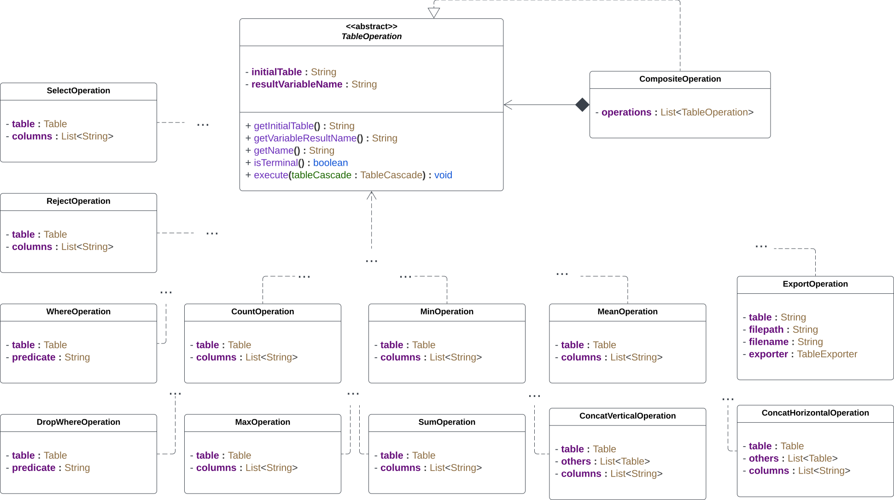

# ELS Project - Racoons Domain-Specific Language
Authors:
- Gustavo Santos [up201907397](mailto:up201907397@edu.fe.up.pt)
- Nuno Alves [up201908250](mailto:up201908250@edu.fe.up.pt)
- Pedro Silva [up201907523](mailto:up201907523@edu.fe.up.pt)

Racoons is a domain-specific language for the creation of tables. It allows for the creation of tables with a simple syntax, that can be exported to different formats, such as HTML, LaTeX, and CSV.

## Language Design
### Inspiration
We took inspiration from the pandas package for Python and from SQL. Especially for our operations:
- Table join.
- Table creation.
- Column creation.
- Column deletion.

### Table Creation
- We created the concept of "source" which is a batch of semi-structured files of the same type (i.e JSON, YAML, XML, CSV and TSV).
    - While not mandatory, the files should have a similar "schema".
- A table can be populated with only one source.
    - The source is optional (table is empty).
- The user can specify zero or more sources in a single configuration file. 
    - They are declared in the corresponding "sources" section at the beginning of the config file.
    - This way a single source can populate more than one table.
- Users can declare sources by using wildcard operators for the path of their files:
    - wildcard for all files of a given type (i.e path/to/files/*.json);
    - wildcard for sub-paths (i.e path/to/experiments/exp*/data.json).
- The user specifies the schemas of all tables he wants to use.
- Our first design didn't allow for a single source file to yield multiple rows in a table (suppose each source file is a JSON file with an array property).
    - For each desired column the user needed to map the property in the source file to a column name.
    - This could be tiresome in the case of nested fields where the user needed to write the property path to those nested fields multiple times.
    - We decided to trade off the simplicity of the initial table schema for a more complex one that allows for more flexibility.
- The source files we are working with all have similar foundations:
    - All support nesting;
    - All support some form of fields: properties in YAML and JSON  or attributes in XML.
- As such, we integrated these concepts into a feature we call Nested Field Traversal (NFT for short).
    - The user traverses the tree of a source file and maps those fields to the desired columns.

### Nested Field Traversal
- NFT is a tree structure that represents the location of specific properties from the source files, and maps them to columns in the table.
- The order of columns in the resulting table is determined by a depth-first traversal of this tree. However, the user is free to alter the position of nodes to change this ordering.
- It allows the usage of multiple useful keywords such as:
    - “$all”: selects all properties of a node. This keyword, and others like it, is resistant to missing properties. This means that if a property is missing in the first source file, but is found on the next, that property is added to the table, maintaining the column order, and the previous rows are filled with null values on that column.
    - “$all-value”: selects all properties of a node that are values (not composite).
    - “$all-container”: selects all properties of a node that are containers.
    - “$except”: selects all properties of a node except ones specified by this node.
    - “$[n]”: selects the n’th element of an array.
    - “$file”: maps the file name of the source file into a value in the table.
    - “$path”: maps the path to the source file into a value in the table.
    - “$directory”: maps the directory of the source file into a value in the table.
- The stand-out feature in NFT is the “$each” node, used in the context of arrays in JSON or elements in XML.
    - It’s functionality lies in unraveling these arrays. It breaks them down into individual rows within the table, where each array element corresponds to a row.
    - “$each” nodes are also tree structures, which allow for further selection of properties and even allow nested “$each” nodes. This allows for further unravelling of arrays, making it possible to deal with complex multidimensional arrays.
    - It is important to note how “$each” interacts with single-row values. Single values that are not part of arrays are repeated for each row generated by the “$each” node. This repetition occurs at every level of depth generated by the nested “$each” nodes.
    - In essence, “$each” can be seen as creating an intermediate table or a new context within the main table, that is then merged.
    - There are of course some edge cases, like two “$each” nodes at the same “$each” depth level, with different array sizes, where the smaller one will be padded with null values.

### Table Operations
- Our operations take a table and, without mutating it, yield a:
    - new table (i.e with select or concat ops);
    - value (i.e with max or sum).
- The user can store these results in variables for future use (with where operation for example).
    - Variables can be re-assigned (but we might drop this if we want to have a language completely without mutation).
- We introduced the concept of a Table Cascade, which consists of a set of operations executed in a linear manner, akin to a pipeline.
    - The operator BTC stands for Begin Table Cascade and will be used in the future to start a table cascade.
- The user specifies “loose” operations or table cascades in the “operations” section.
- The user can do diverse operations such as:
    - ArgMax: Returns the row(s) with the maximum value in a specified column;
    - ArgMin: Returns the row(s) with the minimum value in a specified column;
    - Horizontal Concat: Combines two or more tables by appending columns side by side;
    - Vertical Concat: Combines two or more tables by stacking rows on top of each other;
    - Count: Calculates the number of non-null values in a specified column;
    - Drop Where: Removes rows from a table that meet a given condition;
    - Export: Saves the table to an external file;
    - GroupBy: Groups a table by a specified column;
    - Join: Combines two tables by matching values in a specified column;
    - Max: Returns the maximum value in a specified column;
    - Min: Returns the minimum value in a specified column; 
    - Mean: Calculates the average (mean) of values in a specified column;
    - Reject: Removes specified columns from a table;
    - Rename: Renames specified column in a table with a new name;
    - Select: Retains specified columns in a table and discards the rest;
    - Sum: Calculates the sum of values in a specified column;
    - Where: Filters and returns rows that meet a specified condition.
- Operation order is taken into account.
- The export is now also an operation that can be executed at any time.

### Values
- In the first milestone our values were all strings.
- Now we support a wide range of data types:
    - strings;
    - numbers (longs, doubles, arbitrary precision integers and decimals);
    - booleans.
- A column is not limited to a single type.
    - We designed for flexibility but the user should be careful (i.e a column can have values that are strings and others that are longs).
- Some operations ignore data types which don’t really make sense for them.
    - For example, max only applies to numbers and strings are ignored.
- In the future we will warn the user of this.
- Binary operations between two numbers of different types apply type coercion the same way as Java does.
- Sorts also work with columns whose values have different types (string, null, numbers...).

### Expressions
- Users can write expressions containing:
    - table cascades;
    - arithmetic operations;
    - boolean operations;
    - parentheses;
    - etc.

## Semantic Model
### Table Modelling


### Source Modelling


### Exporter Modelling


### Operation Modelling


### Interpreter Modelling


## External DSL
### Example
```java
t1 = table()

source src1 from (
  "./f*/*.json",
  "./g/single.json"
)

exporter exp1 of csv (
  filename: "empty table" // is mandatory
  path: "/mnt/c" // is mandatory
  endOfLine: "\r\n" // optional
  separator: ";" // optional
)

nft n1 of (
  "version" -> "Version",
  except ( test ) -> "test %s",
  data each (
          student,
          finalGrade,
  ),
)

max1 = table(n1) -> max("finalGrade")

t1 -> concatHorizontal(table(n1))
   -> where(col("finalGrade") == max1) 
   -> sort("Version")
   -> export(exp1)
```

### External DSL Interpreter


### Semantic Analysis
- Static type checking.
  - With inferred types.
  - Checks if the types of the arguments of an expression are compatible with the expression.
- Variable/Symbol existence.
  - Checks if an identifier for a variable/symbol is being used without being declared.
- Cascade terminals in the middle of a table cascade.
  - Checks if terminal operations like max() aren't being used in the middle of a table cascade.
- Start of a table cascade must be a table.
- Operation call compatibility.
  - Checks if the arguments of an operation call are compatible with the operation. 
- Unused expression result.
  - Checks if a variable/symbol is being assigned.
  - Cascades ending in an export operation do not apply to this as they don't need to be assigned.
- Some special operations can only be used inside predicates of where() and dropWhere().
  - This is the case for the col(), containsCol() and isNull() operations.
- Attributes for exporters.
  - Checks if the attributes specified for an exporter are valid.

## Internal DSL
### Source Definition
```java
var decisionTreeSource = new YamlSource(
       "decision_tree",
       List.of(
           "files/check2/run*/decision_tree.yaml"
       )
);

var profilingSource = new JsonSource(
       "profiling",
       List.of(
           "files/check2/run*/profiling.json"
       )
);
```

### Table Creation
```java
var profilingFunctionsTable = new TableSchema("profiling-functions")
        .source(profilingSource)
        .nft(
            directory()
            property("functions", each(
                property(“name”, “Function Name”),
                property(“time%”, “Function Time Percentage”)
            ))
        )
        .collect();
```

### Operations
```java
decisionTreeTable
        .btc()
        .dropWhere((row)->row.get("Criterion").equals(Value.of("gini")))
        .count("CCP Alpha");

profilingTable.btc().select("time%", "name").get();

decisionTreeTable.btc().concatHorizontal(profilingTable).get();
```

## What's Next
- Improved algorithms (and table representation) for complex operations (i.e join, groupBy).
- More customization for table exporters.
- More operations (i.e addRow and addColumn).
- Let the user pass variables containing strings (column names) for operations such as max().

## Build Assignment Tables
In the repository root, you'll find a ``files`` folder containing a folder for each of the checkpoints with the necessary source files and Racoons config file to build the tables requested.

## Project Instructions

For this project, you need to [install Gradle](https://gradle.org/install/)

### Project setup

Copy your source files to the ``src`` folder, and your JUnit test files to the ``test`` folder.

### Compile and Running

To compile and install the program, run ``gradle installDist``. This will compile your classes and create a launcher script in the folder ``build/install/els2023-2/bin``. For convenience, there are two script files, one for Windows (``els2023-2.bat``) and another for Linux (``els2023-2``), in the root of the repository, that call these scripts.

After compilation, tests will be automatically executed, if any test fails, the build stops. If you want to ignore the tests and build the program even if some tests fail, execute Gradle with flags "-x test".

When creating a Java executable, it is necessary to specify which class that contains a ``main()`` method should be entry point of the application. This can be configured in the Gradle script with the property ``mainClassName``, which by default has the value ``pt.up.fe.els2023.Main``.

### Test

To test the program, run ``gradle test``. This will execute the build, and run the JUnit tests in the ``test`` folder. If you want to see output printed during the tests, use the flag ``-i`` (i.e., ``gradle test -i``).
You can also see a test report by opening ``build/reports/tests/test/index.html``.

